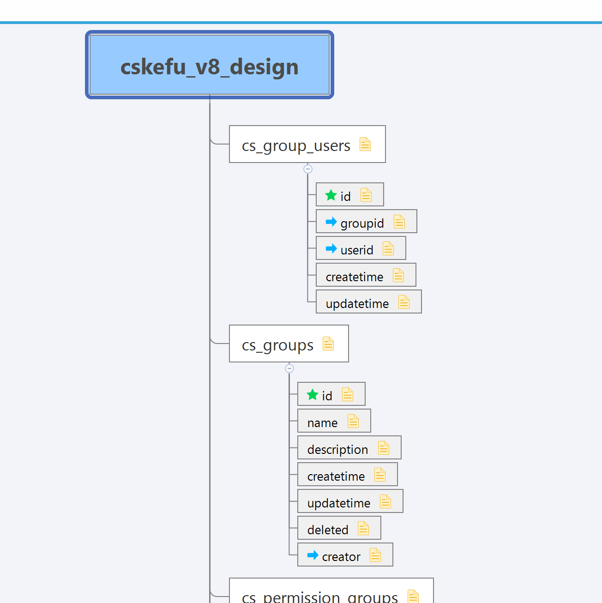

# MySQL 数据库设计工具

[mysql_tables_design](https://github.com/cskefu/mysql_tables_design)

使用 MySQL 数据库管理工具维护数据库，比如 MySQL Workbench、Navicat 等，方便构思，但是不方便检查和供展示阅读。
这时候，使用 HTML 的文本形式或 XMIND 的思维导图形式，可以很好的表现数据库表的设计。

本开源项目提供面向这个目标的两个工具：

* bin/parse-mysql-table-xmind.sh - 生成 XMIND 思维导图
* bin/parse-mysql-table-dicts.sh - 生成春松客服数据库数据字典

## 生成思维导图

### Prerequisite

* Python3+
* pip

### Generate

```
cp sample.env .env
./bin/parse-mysql-table-xmind.sh
```

## 生成数据字典

### Prerequisite

* Php
* pandoc

### Generate

```
cp sample.env .env
./bin/parse-mysql-table-dicts.sh
```


## Samples

### 思维导图



### 数据字典


## License

All rights reserved, [Hai Liang W.](https://github.com/hailiang-wang)

OpenSource License, [Apache 2.0](./LICENSE)